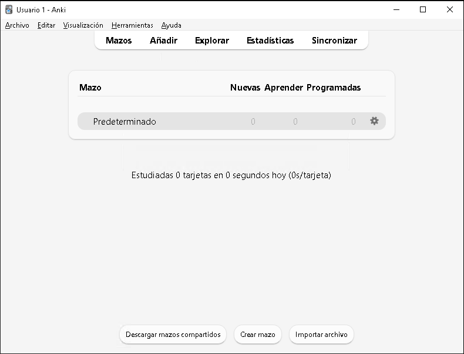
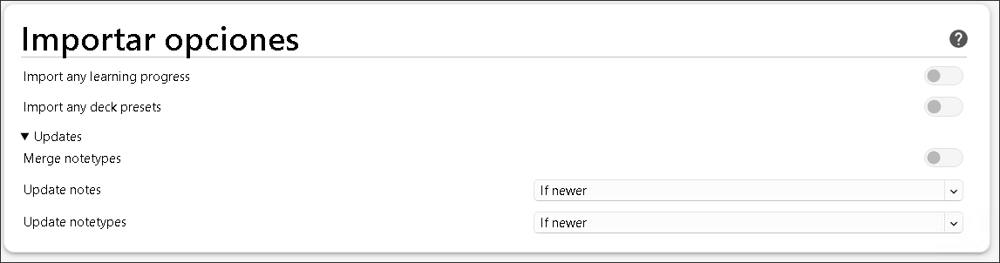
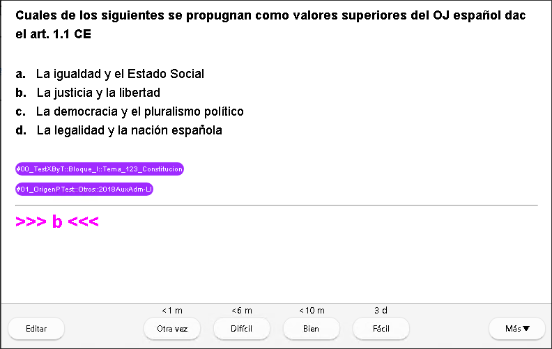
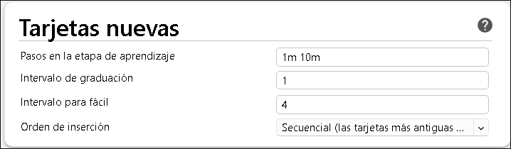
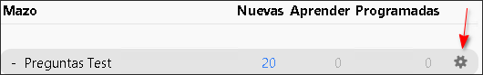
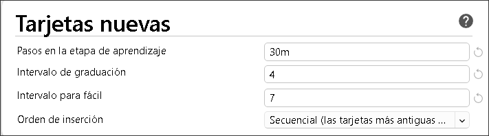
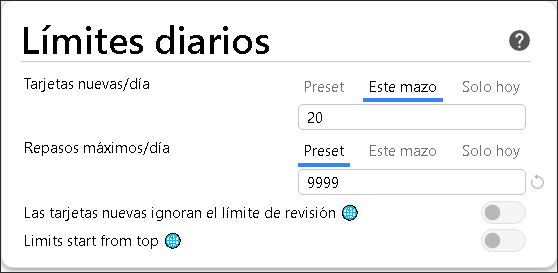
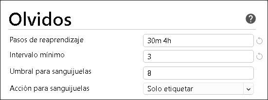
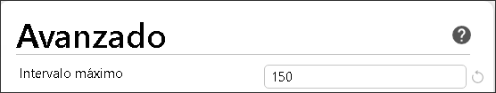
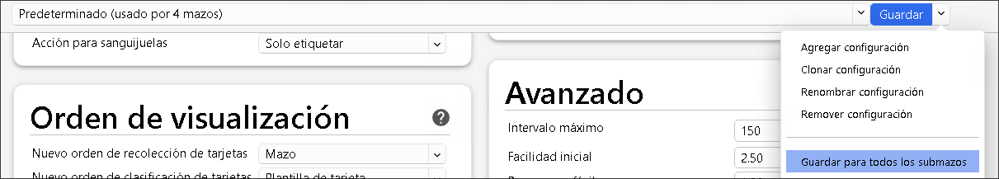

# Índice

- [Aclaración](#aclaración) 
- [¿Por qué Anki?](#porque) 
- [Instalación](#instalación) 
- [Configuración inicial](#init) 
    - [Preferencias generales](#pref) 
- [Importar mazo](#importar-mazo) 
- [Opciones de estudio](#configuración-estudio) 
- [Cómo usar mazos](#usar-mazos) 
- [Lo que esta guía no cubre](#sin-cubrir) 
- [Cómo aportar a la guía](#aportar) 

# Aclaración 

Esta guía esta destinada principalmente para personas que son nuevas en Anki y por lo tanto debe ser seguida con especial atención en caso de que ya estés usando Anki. **No me hago responsable del resultado del uso de la guía**, así que recomiendo realizar una copia de seguridad antes de proceder en caso de que se tengan dudas de las consecuencias de determinados pasos.

El objetivo principal de esta guía no es explicar de manera profunda cómo funciona Anki, sino simplemente ayudar a que una persona que no lo ha usado nunca, pueda empezar con una buena configuración de base para el caso específico de usar Anki para contestar tarjetas que contienen preguntas tipo test.

# ¿Por qué Anki? 

En mi caso, decidí añadir Anki a mis métodos de estudio por la facilidad para diferenciar entre que partes me sé mejor y que partes me sé peor. Ya que las preguntas y por lo tanto conocimiento que me cuestan más, me van a salir más a menudo, mientras que los que me sé mejor me van a ir saliendo en intervalos mayores solamente necesitando ese refresco para mantener la información.

Además, la facilidad de poder cambiar entre dispositivos y tener lo mismo en todos ellos me parece un punto a favor para tener más oportunidades a la hora de ponerse a hacer preguntas.

# Instalación 

Existen versiones de Anki para Windows, Linux, Mac, iOS, Android e incluso se puede usar desde el navegador (no lo he usado nunca). Todas son gratuitas a excepción de la versión de iOS. En la página de Anki puedes encontrar como instalar dependiendo de tu SO.

- [Página web Anki](https://apps.ankiweb.net/) 
- [Enlace a la documentación](https://docs.ankiweb.net/) 
- [Manual en español](https://apps.ankiweb.net/docs/manual.es.html) 

# Configuración inicial (desktop) 

Suponiendo que has conseguido instalar la versión de Anki de escritorio, después de abrir el programa y elegir el idioma, te encontrarás con esto:

Lo primero que deberías hacer es **crear una cuenta en Anki**, para ello, pulsa en el botón `Sincronizar` y sigue las instrucciones para registrarse.

## Preferencias generales 

De las opciones generales que recomiendo cambiar, en el menú `Heramientas-Preferencias`:

- En la pestaña `Apariencia`, activar el tema oscuro.
- En la pestaña `Repasar`, cambiar el valor de "Límite de estudio por adelantado" de `20` a `5` minutos. Esto hace que Anki muestre tarjetas por adelantado si el tiempo hasta repasarlas es de 5 minutos o menos y no tienes otras tarjetas pendientes. Si lo pones a `0`, no adelanta nunca las tarjetas y tendrás que esperar a que pase el tiempo que sea para repasarlas.

# Importar mazo 

Una vez te has conectado a tu cuenta, vamos a importar nuestro primer mazo. Para ello desde la ventana principal de Anki, pulsamos en `Archivo-Importar` y seleccionar el archivo `.apkg` en cuestión. De las opciones de importación recomiendo dejarlas como estén por defecto, en mi caso es con todas  las opciones desactivadas:

Tras la importación, si pulsas el botón de sincronizar, te preguntará que si quieres reemplazar la colección web con tu colección local, pulsa en `sí`.

Esta interacción en la que te pida decidir que colección mantener es habitual cuando has hecho cambios importantes en la colección que tengas, por lo que tienes que estar atento y leer bien el mensaje que te sale y decidir en función del dispositivo en el que estés. Por ejemplo, si has hecho cambios desde la versión de escritorio y te vas al móvil, lo normal será que tengas que mantener la versión web si te sale el mensaje.

# Configuración de estudio 

En mi opinión, las opciones de estudio por defecto no encajan muy bien para usar Anki con preguntas tipo test. Vamos a verlo con un ejemplo:

Para contestar preguntas en Anki, yo recomiendo usar únicamente los botones `Bien` cuando has acertado la respuesta y `Otra vez` cuando has fallado. 

Con los valores por defecto, para una tarjeta nueva, si la aciertas y pulsas `Bien`, te la mostraría en 10 minutos si tuvieras más preguntas que responder, o en 5 minutos si no te quedasen más preguntas en el día (recuerda el ajuste que controla esto en las opciones generales)

Si después de ese tiempo, vuelves a repasarla y pulsas `Bien`, pasará a ser una tarjeta graduada y la volverías a ver dentro de 1 día. Si al día siguiente la acertases otra vez, la volverías a ver a los 3 días. Si quiere más información sobre como funciona el algoritmo de Anki, remitirse a la documentación.

Desde mi punto de vista, para una pregunta que no has visto nunca y has sido capaz de responder a la primera, no tiene sentido volverla a ver después de 10 minutos, y luego al día. 

Vamos a cambiar este comportamiento. Si únicamente vas a usar Anki para estudiar mediante preguntas tipo test, puedes modificar la opción de mazo por defecto. En caso contrario, puedes crear una nueva configuración especifica para determinados mazos (no voy a cubrir eso). Para acceder al menú de cambiar las opciones, pulsar en las opciones del mazo superior:

La opciónes que recomiendo son:

Esto hará que para las tarjetas nuevas:

- Si las contestas `Bien` la primera vez que las ves, la tarjeta se gradúe y hasta dentro de 4 días* no la volverás a ver. Si en 4 días, la vuelves a acertar, no la volverás a ver hasta que pasen 10 días.
- Si la primera vez que la ves fallas y pulsas `Otra vez`, la volverás a ver dentro de 30 minutos. Si dentro de 30 minutos aciertas y pulsas `Bien`, seguiría el mismo intervalo que en el punto anterior. Para el valor de `Pasos en la etapa de aprendizaje` también puedes usar `1d` para que las que falles te salgan al día siguiente y si aciertas entonces sea porque has interiorizado el por qué de la respuesta y no simplemente la has memorizado a corto plazo.

\*En realidad puede que te salga en 3, 4, o 5 días ya que Anki añade algo de aleatoriedad a los intervalos de tarjetas graduadas.

Cabe decir que estos valores son los que me funcionaron a mí y por supuesto eres libre de experimentar con distintos valores hasta encontrar los que te vengan mejor.

Luego en las opciones de límites diarios:

El primer valor indica cuantas tarjetas nuevas **por mazo** vas a poder hacer al día, esto es algo muy personal y he dejado el valor por defecto de 20. 

Mi idea a la hora de usar Anki, es de llevarlo al día, es decir, revisar las tarjetas que toquen cada día y empezar nuevas tarjetas. Cuantas más preguntas nuevas hagas al día, más preguntas vas a tener que repasar en el futuro a la vez, así que debes ajustarlo en función al tiempo del que dispongas.

En cuanto a estas opciones, si fallas una tarjeta que ya está graduada, la volverías a ver a la media hora . Si después pulsas `Bien`, la volverías a ver a las 4 horas. Y si vuelves a acertar, pasaría a tener un nuevo intervalo dependiendo de qué intervalo tenía la tarjeta cuando la fallaste, con un mínimo de 3 días.

Por último, en `Avanzado`, la opción de `Intervalo máximo` determina cual es el intervalo de tiempo que como máximo una tarjeta va a poder tener. En mi caso, 5 meses es el valor con el que me encontraba cómodo.

Ahora importante, en el caso de que hayas creado una nueva configuración, para guardar los cambios que hemos realizado y que se apliquen a todos los submazos que cuelgan del mazo principal, pulsar en la flecha a la derecha de `Guardar` y en `Guardar para todos los submazos`. Si solamente tienes la configuración predeterminada, simplemente pulsa `Guardar`.

# Cómo usar mazos 

Para responder a preguntas simplemente haz click en el mazo correspondiente al tema del que quieras hacer preguntas y pulsar `Comenzar a estudiar`.

# Lo que esta guía no cubre pero es interesante conocer

- [Anki plugins](https://ankiweb.net/shared/addons): existen multitud de Anki plugins que pueden mejorar la experiencia del uso de la versión de escritorio. Únicamente tener precaución sobre qué plugins instaláis ya que van de manera separada al desarrollo de Anki y puede que no funcionen con la versión actual de Anki o contengan código no deseable.
- [Mazos filtrados](https://apps.ankiweb.net/docs/manual.es.html#filtered): Es posible crear mazos en base a determinadas características de las tarjetas, como por ejemplo las etiquetas y hacer una batería de preguntas específicas que pueden (es una opción) no contar para las repeticiones del mazo del que vienen.
- Las versiones de Android/iOS: una vez ya tenéis la cuenta de Anki y tarjetas sincronizadas, la instalación y funcionamiento de las versiones para smartphones es trivial ya que las opciones y mazos se sincronizan. Unicamente, recomiendo entrar en los ajustes para asignar gestos para responder a las preguntas de forma más dinámica. Por ejemplo, deslizar hacia arriba para `Mostrar respuesta`, deslizar hacia la derecha para `Otra vez` y para la izquierda para `Bien`.

# Cómo aportar a la guía 
En el caso de que alguien quiera aportar algo más de información acerca de cómo usar Anki en este contexto y ampliar un poco más esta guía, dirigirse al repositorio y mandar un PR:

- [Enlace al repositorio con la última versión de este documento](https://github.com/xelarro/mini-guia-anki) 
